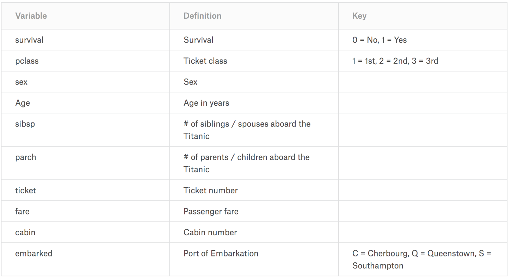
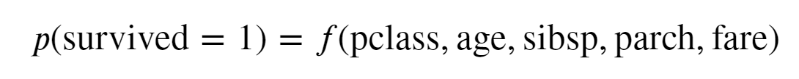
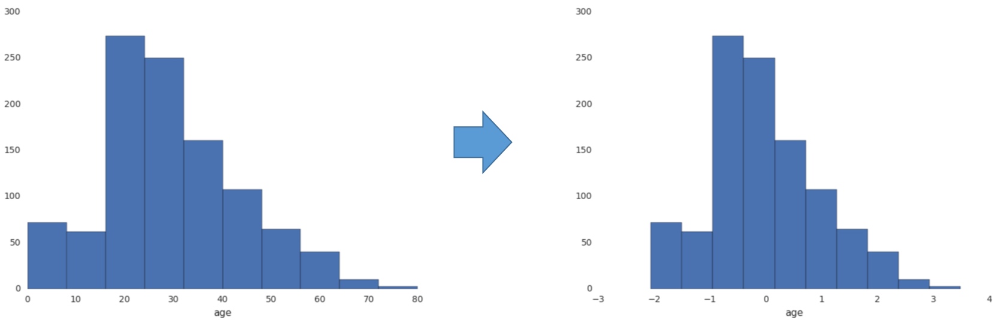
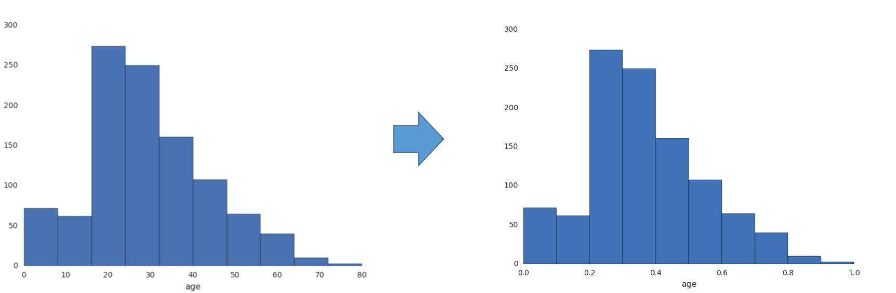
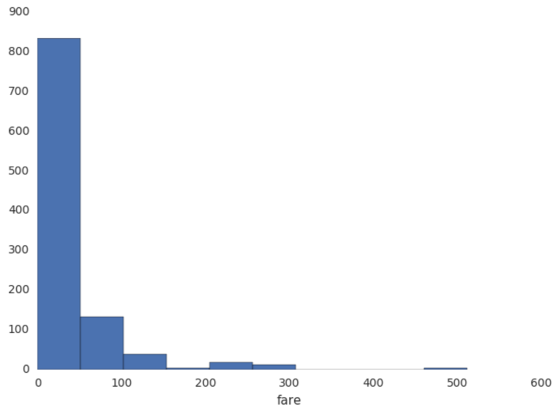
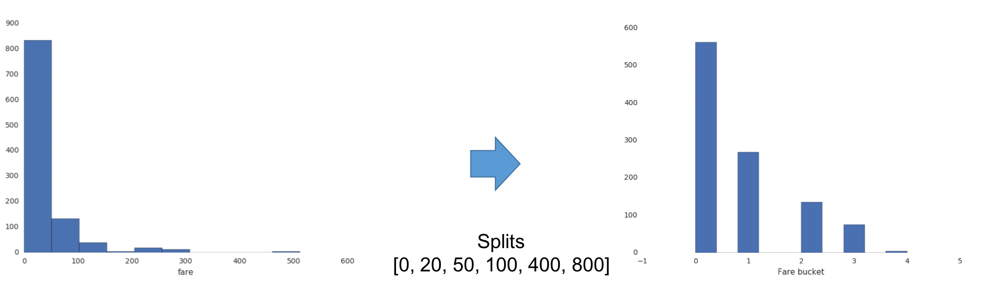
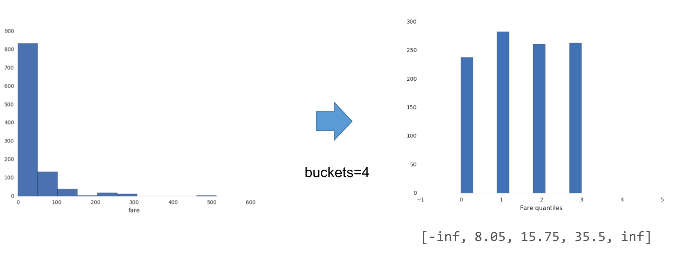
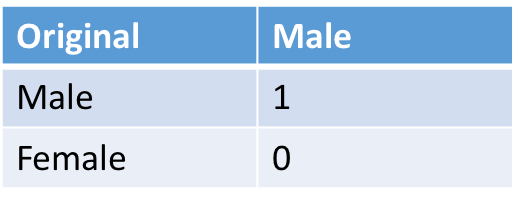
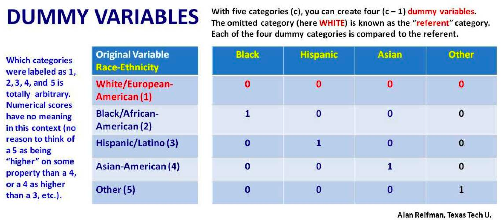

# Lectures notes for Big Data Analytics (IST 718)

- Professor: Daniel Acuna <https://acuna.io>
- Scribers: Eashani Deorukhkar and Jeet Ganatra
- Unit: 07-1 Feature Engineering

## Feature Engineering

This is the process of applying domain knowledge to help algorithms work better/more efficiently/faster. It works by transforming data to a form that works well with the specific algorithm used

Feature Engineering can help algorithms work better in the following ways:
- It can make algorithms converge faster (eg. maybe exponentiating the data could make the algorithm converge)
- Better fit to training data (eg. making the data linear might help)
- Help create more generalizable solutions (eg. Instead of working directly on text, using term document matrices might make the algorithm compatible with various other kinds of text too)
- It can create more interpretable solutions

## Example: The Titanic dataset

The Titanic disaster: British passenger liner that sank in the North Atlantic Ocean in 1921. We have the dataset of the passengers and whether they survived or not. The dataset has the following variables.

Some of these variables are numeric or categorical
- pclass (1, 2, or 3)
- survived (0 or 1)
- age: double
- sibsp: integer
- parch: integer
- fare: double)
whereas some are non numeric. Most algorithms work with numeric data so it can be used directly most of the time.

Consider a simple regression equation:

- AUC = 0.75  

- Parameters:
  - Intercept: 2.8
  - Coefficients: [-0.9888, -0.0377, -0.269, 0.2647, 0.0029]  
The model only considers the columns pclass, age, sibsp, parch and fare for determining whether the person survived.

The intercept determines the chance of survival given all the other values are 0.
The coefficients tell us how the columns affect the chance of survival:

- Pclass: A change of class from 1 to 2 reduces the chance of survival by 90%
- Age: one year increase in age reduces the chance of survival by 3%
- Sibsp: Having a sibling reduces your chances by 20% per sibling
- Parch: each parent increases your chances of survival by 20%
- Fare: each increase in 1 money unit of fare increases your chances of survival by 0.29%

The AUC (Area under curve) tells us how good the model is. An excellent model has AUC near to 1 which means it has good measure of separability. A poor model has AUC near to 0 which means it a bad measure of separability.

## Problems with the model

The independent variables are all on different scales. This can cause issues when it comes to interpreting the model especially for more complex models.

It also becomes a problem when it comes to regularization (Regularizations are techniques used to reduce the error by fitting a function appropriately on the given training set and avoid overfitting.). It is easier to do this when the variables are all on the same scales

## Scaling: Standardization

A way to bring all the parameters on the same scale is to standardize it. This involves converting the data to a normal distribution with mean 0 and standard deviation 1

## Scaled model

- AUC = 0.75 (same)  

- Parameters:
  - Intercept: -0.4
  - Coefficients: [-0.8346, -0.5404, -0.244, 0.2177, 0.1636]  

As all the values are on the same scale, an increase in one unit of each variable will change the probability of survival in the following way:
- pclass: decreases by 80%
- age: decreases by 50%
- sibsp: decreases by 20%
- parch: increases by 20%
- fare: increases by 16%

## Other forms of Scaling

1] Min-max scaling: It transforms a feature to be between 0 and 1. This shifts to features to a different scale and may destroy sparsity

2] Max Absolute Scaling: it transforms a feature to be between -1 and 1. It does not destroy sparsity.

## Non normal data

The distribution of data is usually normal(Gaussian) but sometimes data can follow a non normal distribution i.e. it can vary wildly.

Non numeric data can be dealt with in 2 ways:

- Convert to buckets: The data is divided based on predefined splits. This is used when you have some idea about the structure of the data and can define the splits yourself.

- Quantize: Buckets are made based on quantiles. This is used when you have no idea about the data because quantiles will ensure every bucket has the same amount of values

## Dummy variables

Categorical variables have discrete values which they can take. These can be two or more categories. These variables are converted to dummy variables for easier interpretation.

A dummy variable is a categorical variable that only takes the values 0 and 1.

A categorical variable with 2 values generates 1 dummy variable.

A categorical variable with more than 2 categories needs more dummy variables. If there are n categories. n-1 dummy variables are needed. The omitted category is considered the default value and its effect is included in the intercept. This category is called the "referent"

## Transformers
There are certain functions available that can help transform data in PySpark.

- Term frequency: Tokenizer or RegexTogenizer -> CountVectorizer

- Dummy variable (from number): OneHotEncoder

- Dummy variable (from string): StringIndexer -> OneHotEncoder

- Quantilization: QuantileDiscretizer

- Arbitrary SQL Transformation: SQLTransformer

## CrossValidator

This function sweeps through set of parameters and estimates generalization performance with cross validation.

- Estimator: Pipeline with ML model.
- EstimatorParamMaps: set of parameters to try.
- Evaluator: loss function for choosing best one.
- numFolds: number of folds.
