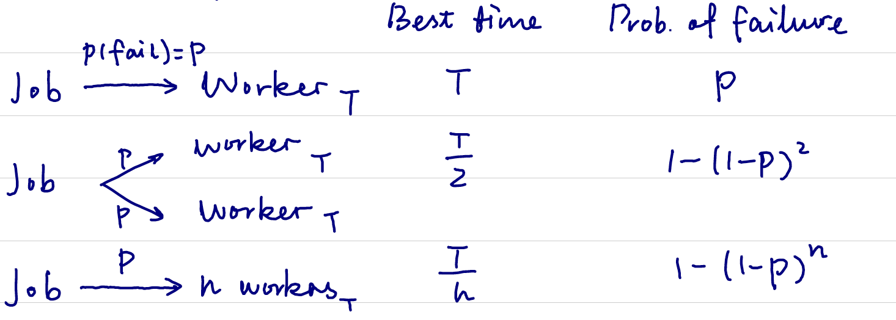

# Hadoop & MapReduce
Lecturer: Prof. Daniel Acuña  
Scriber: Lizhen Liang & Yimin Xiao  

## Introduction to distributed system
- A collection of independent computers that appear to the users as a single coherent system
- It is a very old concept. It has been around since computers were invented.
- Advantages over simple system:
    - It has more processing power.
    - It is cheaper since in old days, a company needed to purchase a bigger computer in order to get more processing power.
    - A distributed system could be more reliable if configured right.
    - It can grow incrementally.

- Disadvantages over simple system:
    - It has more components to fail.
    - Needs customization.
    - Network could be the bottlenet.
    - The security issue could be very complicated.

## CAP theorem

From a **storage perspective**, there are many goals for a distributed system.  
  - **Data Consistency**: all nodes have the same data at the same time.  
  - **Data Availability**: assures that every request can be processed.  
  - **Partition Tolerance**: tolerates network failures, the system continues to operate.    

**it is impossible to fulfill all three of the goals, only two of them can be fulfilled at most**  
**The most important of the three goals**: partition tolerance, if the systems goes down, we still want to provide services.

## More components to fail

Consider a scenario where a job is seperated and assigned to different worker. Since each of the worker has a certain possibility to fail the job and if one of the worker fail the job, the entire job fails, the job is more likely to fail if assigned to many people.  

**Solution**:  
Redundancy / replication: assigning duplicated jobs to different workers.  

## Hadoop
the operating system for big data, meant to store big files. 
- **master node**: Ensure consistency, but it is a single point of failure. Must have big RAM
- **worker nodes**: Runs on commodity hardware; each node runs the same services.
- **client nodes**: Issues command to write the object file into HDFS.  

## MapReduce
MapReduce process:  
**Map -> Shuffle -> Reduce -> Combine**

- **Map**: takes an input element and produces a set of intermediate key/value pairs.
- **Shuffle**: transfer output from mapper to reducer nodes with similar keys. Sicne network time is very expensive, we don’t do shuffle that much
- **Reduce**: accepts an intermediate key and a pair of values for the same key and combines them into zero or one value.
- **Combine**: output of reduced nodes into single output.

**Reduce function only takes two elements at one interation**:  
- To save space on disk.
- So that it can be performed at an arbitary scale.
- No connection between tasks.  

**Key / value pairs**
- Map and reduce can take any operation that is commutive so that the result is independent of order
MapReduce alternitive: Multi-Point Interface 

### Example  

1. **Find the maximum value of the list**   

Map:  
```python
lambda e:
    return (1, e)
```  

Reduce:
```python
lambda v1, v2:
    return max(v1, v2)
```  

2. **Calculate word frequencies**  

Map:
```python
def f(e):
    result = []
    for word in e.split():
        result.append(word, 1)
    return result
```  

Reduce:
```python
lambda v1, v2:
    return v1 + v2
```  

3. **Calculate the average of a list**  

Map:    
```python
def f(e):
    return [1, (e, 1)]
```  

Reduce:
```python
def g(v1, v2):
    a1, n1 = v1
    a2, n2 = v2
    return ((a1 * n1 + a2 * n2) / (n1 + n2), n1 + n2)
```
