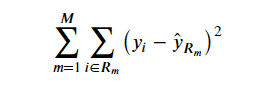

## IST 718 - Random Forest 

### Scribers -  Rohan Nitin Mahajan, Jan Lennart Zeugner.

### Problem: Credit Score

- Predict whether someone will be in financial distress or not.

#### A problem with Logistic regression:
- While logistic regression is a good tool for classification problem it also comes with certain limitations 
- Since logistic regression is a linear model, the boundaries between classes are also going to be linear

## Decision Trees:

- Classification method
- Each node contain a condition/question.
- Answers to the questions - Path that leads to another node.
- Decision tree recursively partitions the feature space into regions R.

#### Prediction:
- For regression:
     - predict the average of a region and evaluate on squared error: 

- For classification:
    - predict the majority of a region and evaluate on distribution of predictions:  

## Optimization of Decision Trees:
- Proposes candidate splits.
- When splitting the data into regions, we attempt to create regions with following a uniform distribution.

- The more regions, there are the better th loss
- However, the more regions, the more likely we are to overfit
- Therefore, we need to prune trees to prevent overfitting.
- Use regularization to penalize leafes

### Problems with Decision Trees:
- There are too many ways to fit the data and, therefore, decision trees tend to overfit and result in too much variance.

## Pros and Cons of Decision Trees:

#### Pros:
- Easy to explain and interpret
- Can easily be visualized
- Limited feature engineering required as trees can handle qualitative variables

#### Cons:
- Low predictive accuracy 
- Not very robust

##### One major problem with Decision Trees is that they have a very high variance.
- However, we can create multiple decision trees and average the results of them.

### Example - Height of Person
- Take average opinion of people to derive a person's height.

- Following central limit theorem (CLT) and given a gaussian distribution, sample variance is smaller than population variance

## Bagging:
- Simulate training datasets. 
- Bootstrapping training data
    - sample with replacement

### Prediction with Bagging
- use several trees and average the predictions of each decision tree and, thus, reduce variance

### Limitations of bagging:  
- Since we are resampling, data points will be reused and trees become correlated. 
- Correlation affects the outcome as it creates bias

### Tree Bagging & Free Validation/Test Data
- Why do we get a free validation/test data?

    
    

