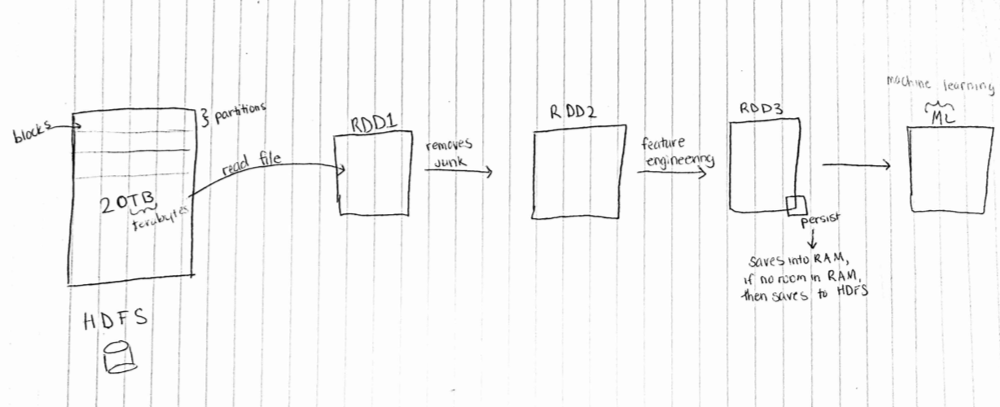

# **Introduction to Apache Spark**
Scriber: Christy Sato

## Data Science Cycle

- As part of the data science cycle, we need Spark for the following:
    - Data Understanding
    - Data Preperation
    - Modeling
    - Evaluation
    - Deployment
  
  
- With Apache Spark, we can see how to take the raw input data (like a data set in a HDFS) and transform it non-destructively to clean it up or analyze it
- Apache Spark allows pipelines which is useful when working with teams
    - Can have different people working on different tasks (i.e. changing emails/ editing)
    - Does not completely change the source data
 
 ## Hadoop
 - Hadoop uses single programming model: MapReduce
 - It only works on hard drives
 - The graph below shows exponential growth, but not a lot
 
 
 ## Spark
 - But with Spark, RAM bandwidth increases exponentially
 - This is because Spark can perform in-memory computations

- Spark has high-level tools, including:
    - Machine learning
    - Spark Streaming: enables high-throughput, fault-tolerant stream processing of live data streams
    - Spark SQL: runs SQL and HiveQl queries
    - GraphX: an API for graphs and graph-parallel computation
    
## Spark Architectural Components
- The first step is creating a Spark session, this is where you can:
    - define configurations like how many workers, RAM, GigaBytes, etc.
- The executors execute nodes that run on JAVA
    - Java unpacks Python file, but this could be problematic

## Spar 1.6+ vs. 2.0+
- Spark 1.6+ can write code in Python
- Spark 2.0+ can run joins and queries on high level data types

## Spark RDDs

- **Lineage**:
  - Information about how an RDD was derived from other datasets or other RDDs.
  - RDD is not necessarily materialized all the time.
  - Lineage captured on disk as "lineage graph."  
  
- **Persistence**:
  - Indicate which RDDs they want to keep in memory. 
  - User can call "persist" method.  
  
- **Partitioning**:
  - RDD elements can be partitioned across machines based on a key in each record.
  
## DataFrames
- The problem with RDDs is that they do not have enough structure
- They are harder to optimize and therefore slow
- DataFrames aim at solving this by adding structure.  
- A DataFrame is a distributed collection of data organized into named columns.  
- Similar to Pandas DataFrames but distributed across the cluster.

- Parquet is resourceful in reading dataframes
    - datasets are stored in columns, which are better than rows because:
        - can query columns
        - can add columns
        - can apply compression algorithms


----
----

# Introduction to Apache Spark

Lecturer: Prof. Daniel Acuña https://acuna.io

Scriber: Chun Xie

### before data modeling, do not forget to

- check data is correct
- structure/transform the data

### Spark application

- data understanding
- data preparation
- data modeling
- evaluation
- deployment

### Hadoop

- save to hard drive

### Spark

- work in memory, fast
- Speed: RAM > SSD > hard drive

### Create Spark session

```python
from pyspark.sql import SparkSession
# Spark 2.0+
spark = SparkSession.builder.getOrCreate()
# Spark 1.6 (RDDs)
sc = spark.sparkContext

```

### Spark RDDs

- RDD: resilient distributed dataset
- a immutable dataset

```python
shakespeare = sc.textFile("/datasets/shakespeare.txt")
love = shakespeare.filter(lambda x: 'love' in x.lower())
```

### Cache it!

```python
%timeit love.count()
```

253 ms ± 42.5 ms per loop (mean ± std. dev. of 7 runs, 1 loop each)

```python
love.cache()
# no effect first time
%timeit love.count()
```

79.2 ms ± 11.1 ms per loop (mean ± std. dev. of 7 runs, 10 loops each)

### *Clean cache!*

```python
# clean cache
love.unpersist()
%timeit love.count()
```

220 ms ± 23.7 ms per loop (mean ± std. dev. of 7 runs, 1 loop each)

### My first map reduce job

```python
example_dataset = [
['JAN', 'NY', 3.],
['JAN', 'PA', 1.],
['JAN', 'NJ', 2.],
['JAN', 'CT', 4.],
['FEB', 'PA', 1.],
['FEB', 'NJ', 1.],
['FEB', 'NY', 2.],
['FEB', 'VT', 1.],
['MAR', 'NJ', 2.],
['MAR', 'NY', 1.],
['MAR', 'VT', 2.],
['MAR', 'PA', 3.]]

dataset_rdd = sc.parallelize(example_dataset)
```

### Compute the number of orders per month

```python
# 1- Generate key-value pairs
dataset_rdd
def map_func(row):
    return [row[0], row[2]]
dataset_rdd.take(3)
dataset_rdd.map(map_func).take(5)

# 2 - Reduce to count the number of orders per month
def reduce_func(value1, value2):
    return value1 + value2
dataset_rdd.map(map_func).reduceByKey(reduce_func).collect()
```

### Compute the average number of orders per month

```python
dataset_rdd.take(4)

#def avg_map_func(row):
#    return ??
def avg_map_func(row):
    return [row[1], [row[2],1]]

#def avg_reduce_func(value1, value2):
#    return [
#        ??
#        ,
#        ??
#    ]
def avg_reduce_func(v1, v2):
    a1, n1 = v1
    a2, n2 = v2
    return [
        (a1*n1 + a2*n2)/(n1+n2)
        ,
        n1+n2
    ]

dataset_rdd.map(avg_map_func).reduceByKey(avg_reduce_func).collect()
dataset_rdd.collect()

```


### Transformations -- are Lazy!

Lazy - they do not compute their results right away.


```python
# Transformations are lazy
neg_values = dist_array.map(lambda x: x-1)
print("neg_values", neg_values.collect())
large_values = dist_array.filter(lambda y: y > 10)
print("large_values", large_values.collect())
```

### Use bash in Jupyter Notebook

```bash
%%bash
cat /tmp/large_values.txt/part-00006
```

### WordCount in Spark

*The character '\' makes you connect your lines safely.*

```python
wordCounts = shakespeare.flatMap(lambda line: line.lower().split()).\
    map(lambda word: (word, 1)).\
    reduceByKey(lambda a, b: a + b).\
    sortBy(lambda x: -x[1])
wordCounts.take(10)
```

### Join operations

**Cartesian Product** between two sets

```python
A = sc.parallelize([(1, 1), (1, 2), (2, 3)])
B = sc.parallelize([(1, "A"), (2, "B")])
A.join(B).collect()
```

### Spark 2.0 -- Dataframes

- RDDs don't have enough structures
- simliar to Pandas
- but distributed across the cluster

From files

```python
df = spark.read.csv('/datasets/potholes_2016.csv', header=True)
df.limit(20).toPandas()
```

### Examples for Spark Dataframes

```python
from pyspark.sql import functions as fn

locations_df = spark.createDataFrame([
    Row(location_id = 'loc1', n_employees=3, state='NY'),
    Row(location_id = 'loc2', n_employees=8, state='NY'),
    Row(location_id = 'loc3', n_employees=3, state='PA'),
    Row(location_id = 'loc4', n_employees=1, state='FL')
])
transactions_df = spark.createDataFrame([
    Row(transaction_id = 1, location_id = 'loc1', n_orders=2.),
    Row(transaction_id = 2, location_id = 'loc1', n_orders=3.),
    Row(transaction_id = 3, location_id = 'loc3', n_orders=5.),
    Row(transaction_id = 4, location_id = 'loc5', n_orders=5.)
])
```

##### Select

```python
locations_df.\
    select('n_employees',
          'location_id',
          'state',
          (fn.col('n_employees') + 1).alias('n_employees_plus_1'),
          (fn.col('n_employees') > 5).alias('more_than_5_empl')
          ).\
    show(10)
```

##### Join

```python
new_df = locations_df.join(transactions_df, on='location_id')
```

##### Groupby and aggregate

```python
locations_df.join(transactions_df, on='location_id').\
    groupBy('state').\
    agg(fn.sum('n_orders')).\
    show()
```

### Spark Random number generation

*Return 3 dataframes (`training`, `validation`, `test`)*

```python
# return 3 dataframes (training validation test)
locations_df.randomSplit([0.5,0.3,0.2])
```
